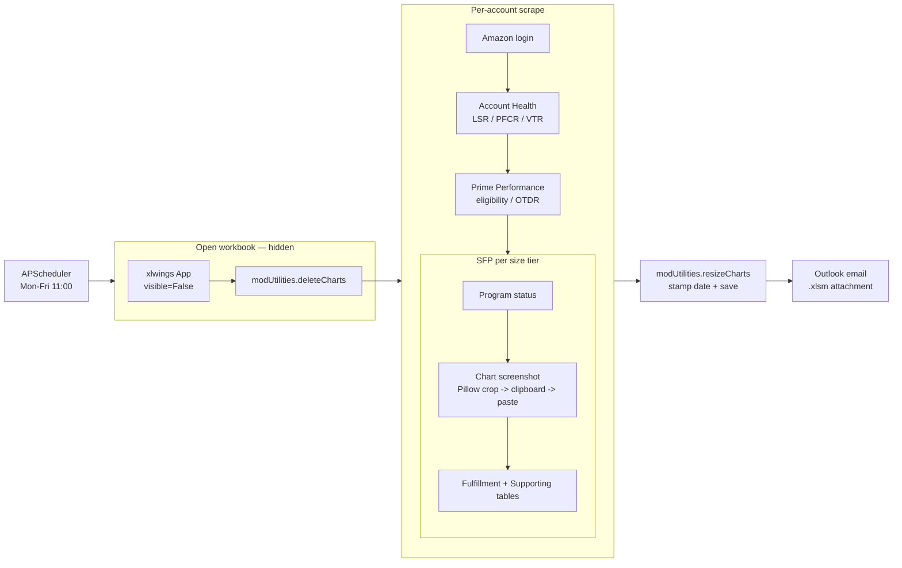

# amzn-account-health

Weekday automation that scrapes each Amazon Seller Central storefront's **Account Health** (Late Shipment Rate, Pre-Fulfillment Cancel Rate, Valid Tracking Rate), **Prime Performance**, and **Seller Fulfilled Prime** metrics — including pixel-cropped screenshots of each account's speed-distribution chart — writes the results into `AH-Metrics.xlsm`, and emails the workbook.

The script is **one Python file** orchestrating five external surfaces: SeleniumBase (Amazon login + DOM scraping across Account Health / Prime / SFP pages), Pillow + Windows clipboard (chart screenshot crop + paste-into-Excel), xlwings (`AH-Metrics.xlsm` opened hidden, two sheets), Outlook (weekday email), and APScheduler (`Mon-Fri 11:00`).

## Weekday flow

1. **Open + clean** — open `AH-Metrics.xlsm` hidden, call `modUtilities.deleteCharts` to clear any pre-existing chart shapes on the dashboard sheet so the new run pastes onto a clean canvas.
2. **Per-account Account Health + Prime** — log into each account in `AMAZON_URLS`, scrape the Performance Dashboard (Late Shipment Rate, Pre-Fulfillment Cancel Rate, Valid Tracking Rate) and the Prime eligibility page (eligibility status, OTDR, Pre-Fulfillment Cancellation Rate, Valid Tracking Rate). Write into the account's column on the metrics sheet.
3. **SFP per size tier** — for each size tier (Standard / Oversize), navigate to the SFP Performance page, scrape program status, screenshot the speed-distribution chart (crop with Pillow, paste via Windows clipboard onto the dashboard sheet), then scrape the Fulfillment and Supporting metrics tables.
4. **Normalize + save** — call `modUtilities.resizeCharts` to standardize chart dimensions, stamp today's date into both sheets' header cells, save and close the workbook.
5. **Email** — send the refreshed `.xlsm` as an attachment via Outlook.

## Architecture



## Performance notes

This is a scrape-and-paste script — there is no SQL Server or Power Query
stage; values are written straight into the workbook. The notable choices:

- **Excel runs hidden.** `xw.App(visible=False)` with `display_alerts=False`
  and `screen_updating=False`, quit in a `finally` block. No flashing window,
  no stolen focus — safe for scheduled runs.
- **Chart capture stays in memory.** Each speed-distribution chart is
  screenshotted, cropped with Pillow, and pushed into Excel through the
  Windows clipboard as a DIB — no temp image files touch disk.
- **Block writes, not cell-by-cell.** Each metric group is assigned to a
  sheet range in a single `range(...).value = df.values` call, minimizing COM
  round-trips.
- **Version-controlled VBA.** Chart housekeeping (`deleteCharts`,
  `resizeCharts`) lives in `vba/modUtilities.bas` and is invoked inline
  (`ah_wb.macro(...)()`), so every run starts on a clean canvas and ends with
  uniformly sized charts.
- **Resilient scrape.** The Account Health read retries on `TimeoutException`
  instead of aborting the run.

## Logging

```text
11:00:02 INFO     Opening workbook and removing charts.
11:00:18 INFO     Navigating to AccountKeyA account.
11:00:33 INFO     Getting AccountKeyA Account Health Statistics.
11:01:07 INFO     Getting AccountKeyA - Standard-size Speed metric charts.
11:03:48 INFO     Organizing charts, saving and closing workbook.
11:04:21 INFO     Email sent.
```

Configured once via the shared helper:

```python
from seller_automation_utils.logging_utils import setup_logging
log = setup_logging("amzn_account_health")
```

`setup_logging` wires a Rich console handler (colorized output, markup
rendering, rich tracebacks) and a 1 MB rotating file handler writing to
`logs/amzn_account_health.log`. Available to every automation that imports
`seller_automation_utils`.

## Project layout

```
amzn-account-health/
├── run_amzn_account_health.py  # entry point (single script)
├── config/
│   ├── accounts.json.example           # Amazon account names + URLs + per-account column/dashboard layout
│   ├── metrics_layout.json.example     # row numbers in the metrics sheet (account-agnostic)
│   └── paths.json.example              # absolute path to AH-Metrics.xlsm
├── vba/
│   └── modUtilities.bas                # canonical VBA source — deleteCharts + resizeCharts
├── screenshots/                        # crash screenshots (gitignored)
├── logs/                               # rotating run logs (gitignored)
├── downloaded_files/                   # Chrome download landing zone (gitignored)
├── output/                             # reserved for future use (gitignored)
├── .env.example
├── requirements.txt
└── README.md
```

## Setup

### 1. Clone and create the venv

```powershell
git clone https://github.com/dominicci13/amzn-account-health.git
cd amzn-account-health
py -3.12 -m venv .venv
.venv\Scripts\pip install -r requirements.txt
.venv\Scripts\pip install git+https://github.com/dominicci13/shared-python-utils.git
```

### 2. Configure

```powershell
copy .env.example .env
copy config\accounts.json.example config\accounts.json
copy config\metrics_layout.json.example config\metrics_layout.json
copy config\paths.json.example config\paths.json
```

Edit each file with real values. All four are gitignored.

`config/accounts.json` has four top-level keys:

- `amazon_account_names` / `amazon_urls` — consumed by `seller_automation_utils.accounts.iter_amazon_accounts()` at import time.
- `account_health_metrics_columns` — maps each account name to its column letter on the metrics sheet (e.g. `"AccountKeyA": "D"`).
- `account_health_dashboard` — per-account chart anchor cell + speed-table column/row anchors on the dashboard sheet.

`config/metrics_layout.json` holds the row numbers for each metric block on the metrics sheet (account-agnostic — these only change when the workbook itself is restructured).

### 3. VBA module (one-time per workbook)

`AH-Metrics.xlsm` must contain the canonical `modUtilities` from `vba/modUtilities.bas`. Open the workbook in Excel, press **Alt+F11**, insert a module named `modUtilities`, and paste the contents of `vba/modUtilities.bas`. Save the workbook.

### 4. Run

```powershell
.venv\Scripts\python run_amzn_account_health.py
```

The script prompts "Run now?" — answer **Y** to execute immediately, or **N** to register the APScheduler job and idle until the next **Mon-Fri 11:00** trigger.

## Environment variables

| Variable | Description |
|---|---|
| `AMZN_email` | Amazon Seller Central login email |
| `AMZN_pass` | Amazon Seller Central password |
| `CHROME_USER_DATA_DIR` | Path to the persistent Chrome profile directory used by the bot |
| `ALERT_EMAIL` | Outlook recipient for unhandled-exception crash reports |
| `SENDER_EMAIL` | Outlook account used to send the weekday email |
| `TO_EMAIL` | Comma-separated recipients |
| `CC_EMAIL` | Comma-separated CC list (optional) |

## Author

Built by **Brian Ramirez** ([@dominicci13](https://github.com/dominicci13)) — automation & AI workflow specialist. More on my [GitHub profile](https://github.com/dominicci13) and [LinkedIn](https://linkedin.com/in/bdramirez).

## License

[MIT](LICENSE)
